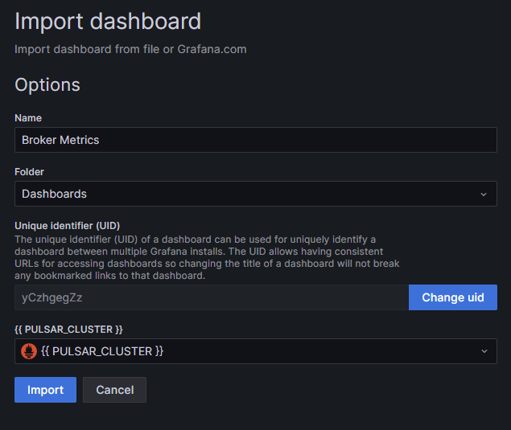

# Prometheus 和 Grafana 使用說明

## Prometheus 簡介

Prometheus 是一個開源系統監控和警報工具箱，廣泛用於收集和存儲指標數據，並提供強大的查詢語言（PromQL）來檢視這些數據。它的主要特點包括：

- **多維數據模型**：使用指標名稱和鍵值對來標識數據。
- **強大的查詢語言**：PromQL 允許進行細致的時間序列數據查詢。
- **無需分布式存儲**：單個節點的時序數據庫。
- **通過 HTTP 拉取模式收集時序數據**：支持通過 HTTP 從目標拉取數據。
- **多種圖形和儀表板支持**：易於與 Grafana 等工具集成。

## Grafana 簡介

Grafana 是一個跨平台的開源指標分析和可視化套件。它主要用於數據可視化，儀表板創建和數據查詢。其特點包括：

- **豐富的視覺化選項**：提供多種圖表類型來展示數據。
- **支持多數據源**：能夠與 Prometheus、Elasticsearch 等多個數據源集成。
- **高度可定制的儀表板**：用戶可根據需要自定義儀表板。
- **警報功能**：支持設置數據閾值警報。

## 使用情境

在本項目中，Prometheus 和 Grafana 被用於監控和可視化 Docker 容器和服務的性能。這包括 CPU 使用率、記憶體使用、網絡流量等多種指標。此外，透過設定的 `scrape_configs`，Prometheus 將從 Pulsar 相關服務（如 broker、bookie 等）收集指標，這些服務透過外部網絡連接。


## cAdvisor 簡介

cAdvisor（Container Advisor）是專門用於監控容器資源使用和性能特性的工具。它提供了容器的詳細資源使用資料，如記憶體、CPU、網絡和檔案系統的使用情況。

### 使用案例
- **容器資源使用監控**：實時監控 Docker 容器的資源使用情況，幫助識別過度資源消耗的容器。
- **性能分析**：分析容器的性能特性，識別可能的性能瓶頸。

### 運作方式
cAdvisor 透過分析主機系統的核心和 Docker API，自動發現並收集所有容器的性能指標。這些指標隨後被 Prometheus 抓取並儲存，可在 Grafana 中進行可視化和分析。

## node_exporter 簡介

node_exporter 是 Prometheus 的一部分，用於收集宿主機（即運行 Docker 容器的伺服器）的硬體和操作系統指標。

### 使用案例
- **系統資源監控**：監控伺服器的 CPU、記憶體、磁碟和網絡使用情況。
- **硬體健康檢查**：提供伺服器硬體的健康狀態和性能指標。

### 運作方式
node_exporter 在宿主機上運行，收集各種系統和硬體相關指標，如操作系統指標（CPU、記憶體、磁碟使用情況等）和硬體指標（溫度、風扇速度等）。這些數據被 Prometheus 定期抓取並儲存，並可透過 Grafana 進行查詢和可視化。


## 配置和使用

1. **Prometheus 配置**：配置文件 `prometheus.yaml` 定義了 Prometheus 的抓取目標和頻率。在本項目中，它被配置為每15秒從不同服務（包括自身）收集指標。
   1. name 設置為 `{{ PULSAR_CLUSTER }}` 是因為 pulsar 官方提供的 dashboard 中的資料源都是以 `{{ PULSAR_CLUSTER }}` 作為名稱，因此這邊也使用 `{{ PULSAR_CLUSTER }}` 作為名稱，有可能是要另外設置 variable，但尚未找到在各個 dashboard 中正確設置 `{{ PULSAR_CLUSTER }}` 的方法，因此先使用這種方式。

2. **Grafana 配置**：
   1. 透過 ./grafana/provisioning/datasources/ 資料夾下的 `datasource.yaml` 配置 Prometheus 的數據源。
   2. 透過 ./grafana/provisioning/dashboards/ 資料夾下的 `dashboard.yaml` 配置要匯入給 Grafana 的儀表板。但因為使用 provisioning 的方式在 Grafana 中匯入儀表板的話，有任何更動都無法直接儲存在 volume data 中，要另外將更動後的 dashboard.json 存回 ./grafana/provisioning/dashboards/ 資料夾下，使用上較不方便，因此 ./grafana/provisioning/dashboards/ 資料夾下的各個 dashboard 就作為匯入時的初始參考，實際使用的 dashborads 還是依據 volume data。
   3. import 時 {{ PULSAR_CLUSTER }} 選擇 名稱為 `{{ PULSAR_CLUSTER }}` 的 datasource
      

## 部屬方式

### 環境配置
1. 建立 volumes 的資料夾
2. 建立 prometheus 的資料夾, 並將 prometheus.yaml 放入
3. 建立 external network: `monitoring_network`
用來連接 pulsar 和 monitoring 的 container
```bash
docker network create --driver bridge --subnet=172.21.0.0/16 --gateway=172.21.0.1 monitoring_network
```
註:pulsar cluster 的 internal network 配置在 172.20.0.0/16, gateway 172.20.0.1

4. 透過 docker-compose 啟動 monitoring compose container
5. 查看 prometheus 的 ui 網頁: http://192.168.25.102:9090
6. 查看 grafana 的 ui 網頁: http://192.168.25.102:3333
   1. 預設帳號密碼: admin/admin，密碼已變更為同 192.168.25.102 aaPanel 登入密碼

## 備註
- 確保所有服務（包括 Prometheus 和 Grafana）都連接到 `monitoring_network`，以實現網絡間的連通性。

## reference
- [Prometheus](https://prometheus.io/docs/tutorials/getting_started/)
- [Prometheus Github](https://github.com/vegasbrianc/prometheus)
- [Apache Pulsar Grafana Dashboard](https://github.com/streamnative/apache-pulsar-grafana-dashboard?tab=readme-ov-file#apache-pulsar-grafana-dashboard)
- [Pulsar Monitoring Document](https://pulsar.apache.org/docs/3.1.x/deploy-monitoring/)
- [Run Grafana via Docker Compose](https://grafana.com/docs/grafana/latest/setup-grafana/installation/docker/#run-grafana-via-docker-compose)
- [How to Set Up Grafana and Prometheus Using Docker](https://dev.to/chafroudtarek/part-1-how-to-set-up-grafana-and-prometheus-using-docker-i47)
- [如何使用 Pulsar Dashboard 监控](https://mp.weixin.qq.com/s?__biz=MzUyMjkzMjA1Ng==&mid=2247484093&idx=1&sn=2731f74cbd2558ab8b1cb833d01db70e&scene=21#wechat_redirect)
